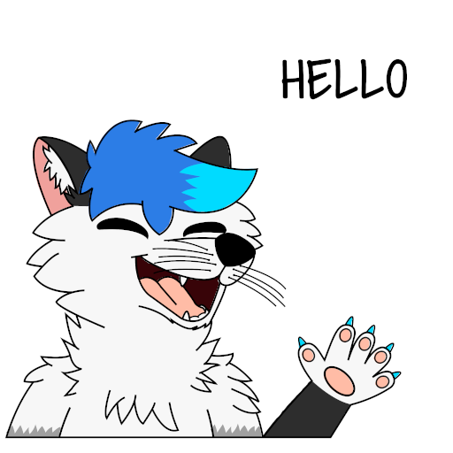

  

<h1 align="center"> <b>Teko ❄️</b></h1>

<h2 align="center">I'm a self-taught dev, Photographer 📷 and Artist</h2>
 

I'm Teko and I am a part self-taught developer from Spain. Currently studying computer engineering and working on my personal projects. Apart from coding I also enjoy creating art and watching anime, go follow my <a href="#social_networks">social networks</a> to find out!

If you haven't noticed yet, I am <a href="https://es.wikipedia.org/wiki/Furry_fandom">furry</a>.

<h2>⌨️ What do I do?</h2>

Mainly I work on projects for my own like Discord bots and simple terminal programs, but I would like to work on some other projects with people.

<h2>💻 Currently working on</h2>

- <a href="https://github.com/tekofx/furbot">Furbot:</a> Multipurpose bot for discord

- <a href="https://github.com/tekofx/web">Web:</a> My own website

- <a href="https://github.com/tekofx/linkleaf">LinkLeaf:</a> An alternative to LinkTree

<h2>⚙️Languages and tools</h2>

  
  
  
  
  
  
  
  
  
  
  
  
  
  
  

<h2>📣 Social networks</h2>

    
    
    
    

<h2>Github stats</h2>

